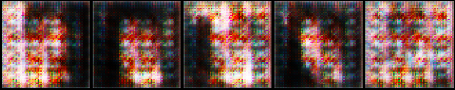
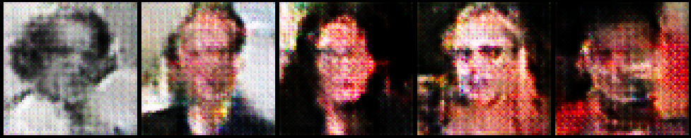

# Face Aging using an Encoder - Conditional DCGAN Network

Since 2014, GANs (Generative Adversarial Networks) have gained great popularity in generating data. Conditional GANs work as an extension to the GAN framework as many times we want to generate data based on a particular condition/label. In this case, that condition is **age**. Our end goal is to be able to take a person's face image and then be able to generate how they would look at a different age. In this blog post, we will elaborate on our method to tackle this task along with an explanation of our results.

## High Level Idea 
Our idea consisted of two main steps:
* Training a Conditional DC-GAN (cGAN) to be able to generate images of people at different ages
* Training an Encoder to learn a mapping between generator outputs and noise vectors to be able to generate images of a paritcular person at different ages.

For training purposes, we decided to only use **two** age groups - 20-30 and 40-50. Images were obtained from the **IMDB-WIki Dataset**.

  

## Step 1: cGAN

Sadly as we know, as people age, they start to look different i.e same people at different ages have different features. 
On the basis of this inductive bias, we train a cGAN by concatenating a **one hot encoding vector** to the noise vector for the Generator and to the convolution layer in the Discriminator. Images of people with an age between 20-30 are given a label 0 and those with an age between 40-50 are given a label of 1. This vector adds information to the noise vector by telling the Generator to produce an image with certain features depending on the concatenated vector. 

  

The above diagram shows the structure of our Generator. We use ConvTranspose2d layers with a filter size of 4 along with BatchNorm and ReLU activation functions. For the last layer, we remove the BatchNorm and use a Tanh activation function.

  

The above diagram shows the structure of our Discriminator. We use Conv2D layers with a filter size of 4 along with Batch Norm and ReLU activation functions. For both the first and layer, BatchNorm is removed and a Sigmoid activation function is used in the layer.

### Training

  

  

  

The above pictures show how the outputs of our GAN get better over time. 

### Conditioned Outputs

We would also like to check how well our GAN is learning the conditioning against age. In order to see that, we generate noise vectors and send the same noise vectors into the Generator with different age labels.

  

The above picture is the output for when the age label is 0.

  

The above picture is the output for when the age label is 1.

Clearly, there isn't much difference between the two. The reason for this is two fold:
* There isn't that drastic a change in the features between people of ages 20-30 and 40-50.
* The outputs of the GAN are blurry due to which its hard to make out what the actual facial features are. 

## Step 2: Encoder
Clearly, there exists a mapping between the noise vectors and the Generator outputs. However, the GAN does not learn this inverse mapping. In order for us to produce images of a person of a different age, we have to be able to generate the respective noise vector for that person. Once we have this vector, we can concatentate the age we want to see this person at and run it to through the generator. 

  

The figure above shows the structure of our encoder. The Encoder uses filter sizes of size 5 along with BatchNorm and ReLU activation functions. Be careful with the last layer of the Encoder because it is important to use **NO** activation function. This is because we are trying to learn the distribution of noise vector and using an acitvation function will squash the output to an undesired range.

### Training
In order to train the Encoder, we first run the trained Generator to generate synthetic images and use the respective noise vectors as labels. This will be used as Training Data for the Encoder. On training the encoder, we obtain a loss of about 0.6. This indicates that we lose about **50-60%** of the information. The importance of this will be seen later. 

## Putting Everything Together
Now that we have both our networks, we can start generating images of people at different ages! The first step is to choose a particular face image and run it through the encoder to get its represented noise vector. After that, we choose which age we want to see that person at and run both the obtained noise vector and age through the Generator. This gives us our desired output.

## Results

  

  

The first image is the input to the Encoder. The output of the Encoder is fed into the Generator, the outputs of which is depicted in the second image. Based on the second output, we can see that our Encoder was successful in learning a mapping between the cGAN outputs and the noise vectors. However, we can see that these outputs are **more blurry** as compared to the Generator outputs. This is when the loss of the Encoder becomes important. The 50-60% of the information that we lose is in the sharpness of the image, due to which these results are more blurry.

## Improvements
* Based on the results of the cGAN, we can see that there seems to be very **little difference** between most people of ages between 20-30 and 40-50. Adding more age groups as well older age groups should help the Generator learn more discerning features between them.
* We can see that we lose information in mapping the generator outputs to their respective noise vectors. Optimization techniques can be used to reduce this loss.

